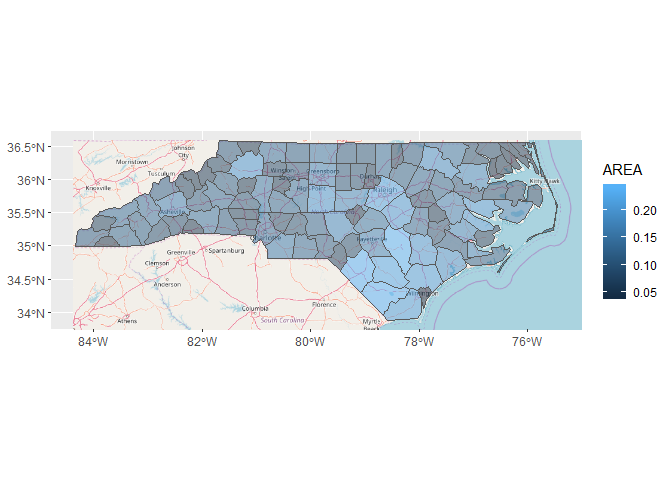

<!-- README.md is generated from README.Rmd. Please edit that file -->
ggopenstreetmap
===============

**This package is under heavy development; do not use!**

An experimental package to plot OpenStreetMap tiles with `geom_sf()`.

Installation
------------

``` r
devtools::install_github("yutannihilation/ggopenstreetmap")
```

Example
-------

``` r
library(ggplot2)
library(ggopenstreetmap)

nc <- sf::st_read(system.file("shape/nc.shp", package = "sf"), quiet = TRUE)

ggplot(nc) +
  annotation_osm(nc) +
  geom_sf(aes(fill = AREA), alpha = 0.5)
```


